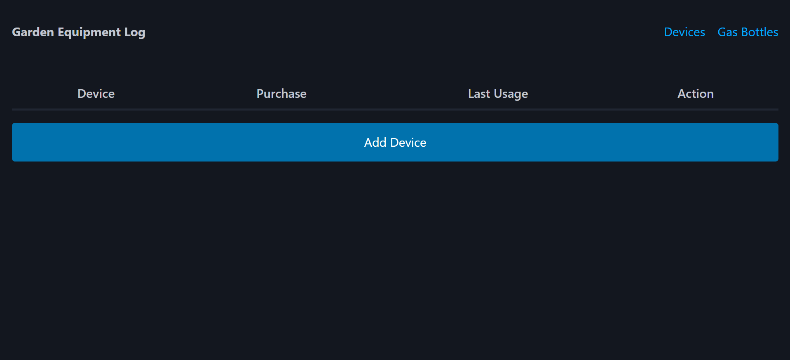
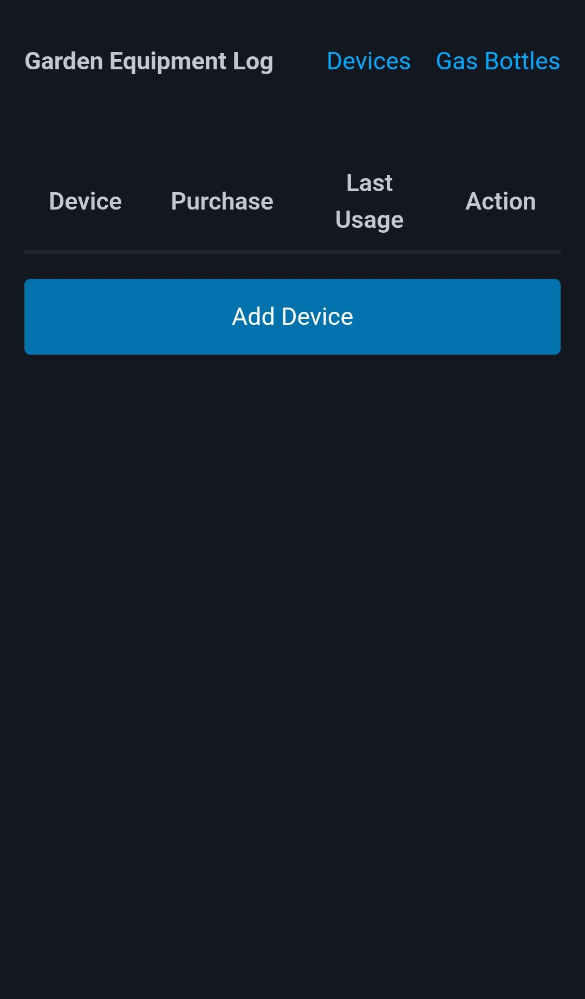

# Garden Equipment Log

A minimal garden equipment tracker built with Go.

---

## 📌 About

**Garden Equipment Log** helps you track your garden equipment usage over time.

Record operation times of devices, track usage and weights, and monitor fill levels of gas bottles.

The application is designed to be lightweight, fast, and simple with a minimal frontend and no unnecessary complexity.

The application is PWA ready and can be used like a native application.

No external dependencies are required.

---

## 🖼️ Screenshots

### Desktop

### Mobile

---

## 🛠️ Built With

- Go
- Pico CSS
- Chart.js
- Font Awesome

All assets are bundled locally.

---

## 📚 Related Projects

- [Strength Tracker](https://github.com/lukas-arnold/strength-tracker)
- [Consumption Tracker](https://github.com/lukas-arnold/consumption-tracker)

---

## 📄 License

MIT License
